  
# Ujian Pemeroses Data Tersebar

Aplikasi ini berjalan dengan menggunakan database Oracle, System Administrator menggunakan CodeIgniter dan Interface di Mobile Apps (Android). Komunikasi data antar Aplikasi menggunakan *RESTful Service* di Oracle.

# Requirements

- [Virtual Box](https://www.virtualbox.org/wiki/Downloads) (Virtual Server)Oracle VM VirtualBox adalah perangkat lunak virtualisasi, yang dapat digunakan untuk mengeksekusi sistem operasi "tambahan" di dalam sistem operasi "utama"
- [Oracle Developer Day 11g](https://www.oracle.com/technetwork/database/enterprise-edition/databaseappdev-vm-161299.html) (Database)Oracle Corporation adalah salah satu perusahaan utama pengembang sistem manajemen basis data, perangkat lunak untuk mengembangkan basis data, perangkat lunak manajemen hubungan pelanggan, enterprise resource planning dan perangkat lunak manajemen rantai pasok. Oracle Corporation didirikan pada tahun 1977.
- [Android Studio](https://developer.android.com/studio) (Android IDE)Android Studio adalah Integrated Development Enviroment untuk sistem operasi Android, yang dibangung diatas perangkat lunak JetBrains IntelliJ IDEA dan didesain khusus untuk pengembangan Android.
- [Codeigniter](https://www.codeigniter.com/) (Framework PHP)CodeIgniter merupakan aplikasi sumber terbuka yang berupa kerangka kerja PHP dengan model MVC untuk membangun website dinamis dengan menggunakan PHP. CodeIgniter memudahkan pengembang web untuk membuat aplikasi web dengan cepat mudah dibandingkan dengan membuatnya dari awal.

## Tutorial

### Database

Aplikasi ini memiliki 5 table, yaitu :

1. [Customer](#table-customer)
2. [Barang](#table-barang)
3. [Pembelian](#table-pembelian)
4. [Penjualan](#table-penjualan)
6. [Supplier](#table-supplier)

#### Table Customer

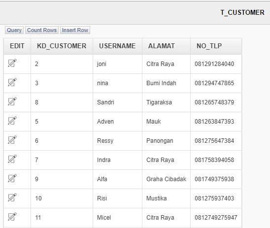

#### Table Barang


#### Table Pembelian


#### Table Penjualan


#### Table Supplier


#PUT dan DELETE menggunakan {id} untuk mengidentifikasi data yang akan dieksekusi.  
Metode HTTP yang digunakan dalam aplikasi ini adalah:
GET
POST
PUT
DELETE

*resource Handler & query* dapat dilihat pada gambar dibawah ini.

#### *restful service* pada barang

- **get barang**  
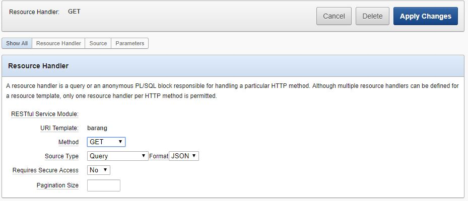

- **post barang**  
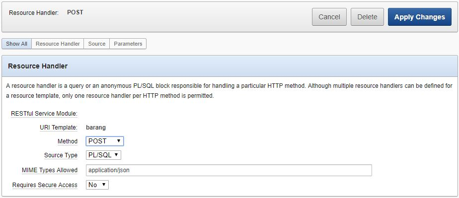

- **put barang**  
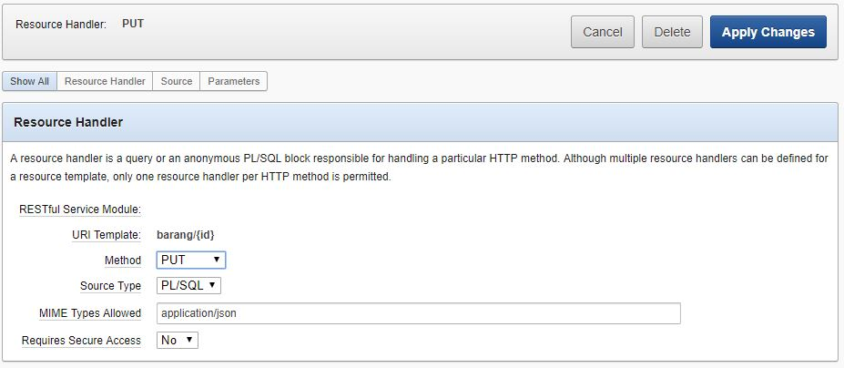

- **delet barang**  


#### *restful Service* pada customer

- **get customer**  
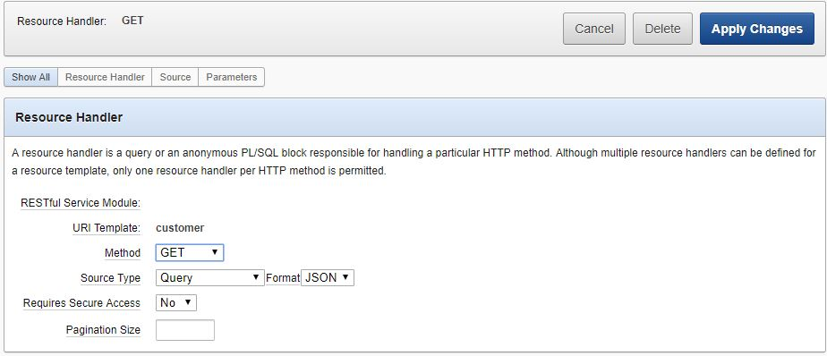

- **post customer**  
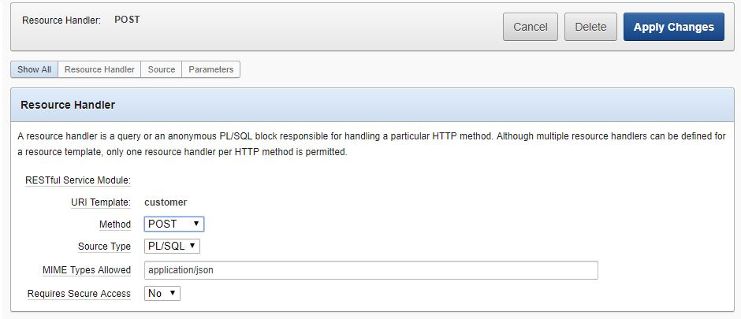


- **put customer**  
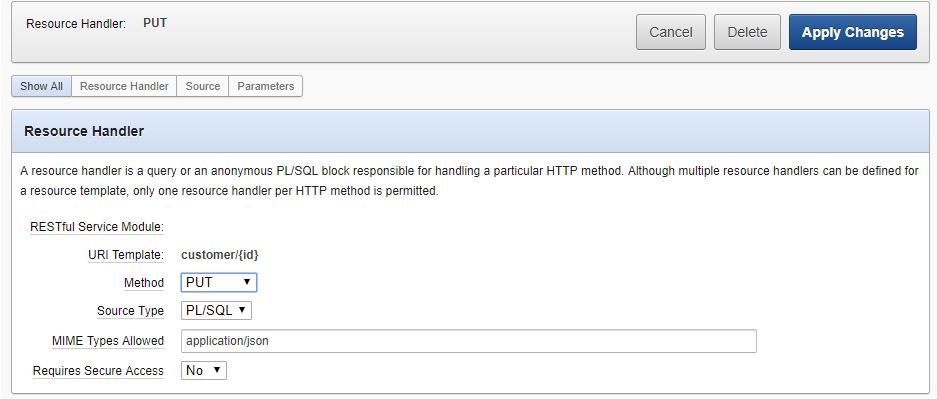

- **delet Customer**  


#### *restful service* pada Penjualan

- **get penjualan**  
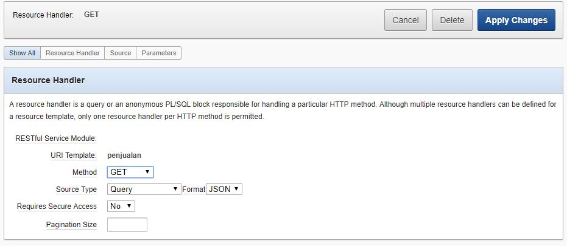

- **post penjualan**  
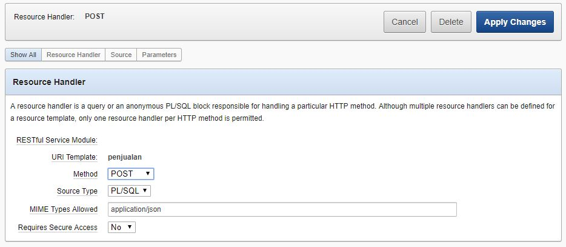

#### *restful Service* pada Pembelian

- **get Pembelian**  
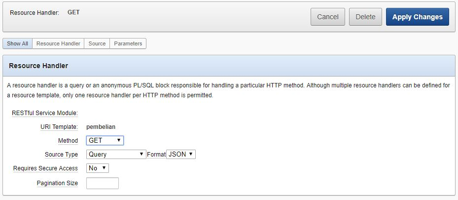

- **post Pembelian**  


#### *restful Service* pada Supplier

- **get Supplier**  
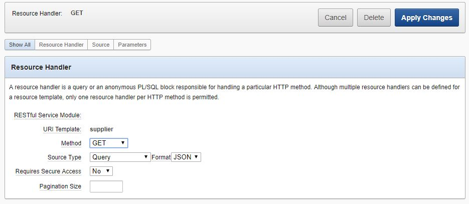

- **Post Supplier**  
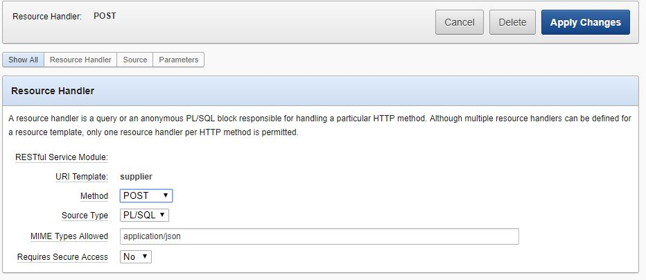

- **Put Supplier**  


-

### CodeIgniter

[Script](./oracle-uas/application/libraries/Api.php)  ini merupakan script php yang digunakan untuk mengakses *RESTful Services* dari Oracle menggunakan library [Goutte](https://github.com/FriendsOfPHP/Goutte).

```php
use GuzzleHttp\Client;

defined('BASEPATH') or exit('No direct script access allowed');

class Api
{
    private $client;

    public function __construct()
    {
        // base url yang digunakan untuk mengakses RESTful API
        $this->client = new Client(['base_uri' => 'http://192.168.43.75:8888/apex/obe/']);
    }

    public function request($method, $uri, $data = [])
    {
        // data di convert menjadi data JSON
        $options['json'] = $data;

        // jika metode HTTP nya adalah DELETE maka response yang diberikan adalah status code nya
        if ($method == 'delete') {
            $request = $this->client->request($method, $uri);
            return $request->getStatusCode();
        }

        $request = $this->client->request($method, $uri, $options);

        // response yang diberikan berupa content nya
        return $request->getBody()->getContents();
    }
}
```

#### Tampilan Web

- Barang


- Customer


- Penjualan


- Pembelian


- Supplier


#### Tampilan Mobile Apps


